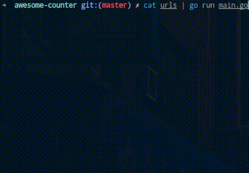

## Задание

Программа читает из stdin строки, содержащие URL. На каждый URL нужно отправить HTTP-запрос методом GET и посчитать кол-во вхождений строки "Go" в теле ответа. В конце работы приложение выводит на экран общее кол-во найденных строк "Go" во всех переданных URL, например:

```
$ cat urls | go run src/cmd/wb-test/main.go
Count for https://golang.org/: 9
Count for https://golang.org/doc/: 64
Count for https://golang.org/compress/: 6
...
...
Total: 253
```

Каждый URL должен начать обрабатываться сразу после вычитывания и параллельно с вычитыванием следующего. URL должны обрабатываться параллельно, но не более k=5 одновременно. Обработчики URL не должны порождать лишних горутин, т.е. если k=5, а обрабатываемых URL-ов всего 2, не должно создаваться 5 горутин.

Нужно обойтись без глобальных переменных и использовать только стандартную библиотеку.

Для проверки работы используем следующий файл `urls`:

```
https://golang.org/
https://golang.org/doc/
https://golang.org/pkg/compress/
https://golang.org/pkg/compress/gzip/
https://golang.org/pkg/crypto/md5/
https://golang.org/pkg/debug/pe/
https://golang.org/pkg/log/syslog/
https://golang.org/pkg/sort/
https://golang.org/pkg/strconv/
https://golang.org/pkg/strings/
https://golang.org/pkg/sync/
https://golang.org/pkg/strings/
https://golang.org/pkg/time/
https://golang.org/pkg/unicode/
https://golang.org/pkg/unsafe/
https://godoc.org/golang.org/x/benchmarks
https://godoc.org/golang.org/x/net
https://godoc.org/golang.org/x/mobile
```

## Решение

| Файлы   | Для чего       |
| ------- | -------------- |
| main.go | Исходный код   |
| urls    | Входные данные |

Моя система для проверки

```
Linux stepanoff-wpc 4.4.0-17134-Microsoft #48-Microsoft Fri Apr 27 18:06:00 PST 2018 x86_64 x86_64 x86_64 GNU/Linux
```

Пример запуска

```
stepanoff@stepanoff-wpc:/mnt/c/Users/StepanOFF/Desktop/wildberries-test$ cat urls | go run main.go
Count for  https://golang.org/ :  9
Count for  https://golang.org/pkg/compress/ :  6
Count for  https://golang.org/pkg/compress/gzip/ :  10
Count for  https://golang.org/doc/ :  67
Count for  https://golang.org/pkg/crypto/md5/ :  6
Count for  https://golang.org/pkg/debug/pe/ :  8
Count for  https://golang.org/pkg/log/syslog/ :  6
Count for  https://golang.org/pkg/sort/ :  43
Count for  https://golang.org/pkg/strings/ :  32
Count for  https://golang.org/pkg/strconv/ :  31
Count for  https://golang.org/pkg/sync/ :  9
Count for  https://golang.org/pkg/time/ :  30
Count for  https://golang.org/pkg/strings/ :  32
Count for  https://golang.org/pkg/unicode/ :  24
Count for  https://golang.org/pkg/unsafe/ :  9
Count for  https://godoc.org/golang.org/x/benchmarks :  7
Count for  https://godoc.org/golang.org/x/net :  8
Count for  https://godoc.org/golang.org/x/mobile :  18
Total:  355
```
